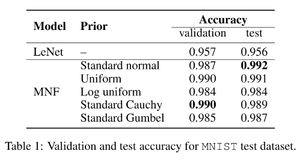
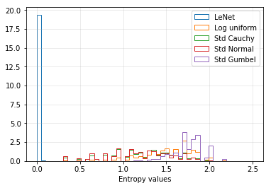
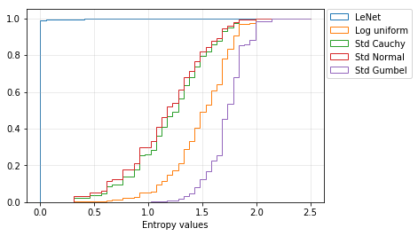

<h2 align="center">
  Analysis of priors for Multiplicative Normalizing flows in Bayesian neural networks
</h2>

We explore Multiplicative Normalizing flows [1] in Bayesian neural networks with different prior distributions over the network weights. The prior over the parameters can not only influence how the network behaves, but can also affect the uncertainty calibration and the achievable compression rate. We experiment with uniform, Cauchy, log-uniform, Gaussian, and standard Gumbel priors on predictive accuracy and predictive uncertainty.

### Code organization
We use the code implemented by authors available here: [AMLab-Amsterdam/MNF_VBNN](https://github.com/AMLab-Amsterdam/MNF_VBNN). `src` folder contains the codes for MNF, LeNet and soft weight sharing [2] ([code](https://github.com/KarenUllrich/Tutorial-SoftWeightSharingForNNCompression)). To run all experiments with default parameters
```
cd src/mnf
python mnf_lenet_mnist.py
```
To specify the prior distribution, modify PARAMS in `constants.py`. Available options are `['standard_normal', 'log_uniform', 'standard_cauchy', 'standard_gumbel', 'uniform']` (`'gaussian_mixture'` support will be added soon.)

**Dependencies**: The code requires tensorflow. We have created a `environment.yml` file with the (working) package versions. It can be installed using conda.

### Experiments and Results

**Predictive performance**: Table below shows the validation and test accuracy achieved on the `MNIST` dataset.

<!-- | Prior           	| Val. acc. 	      | Test acc. 	|
|:----------------	|----------------:	|----------:	|
| Standard normal 	| 0.987           	| **0.992**   |
| Log uniform     	| 0.984           	| 0.984     	|
| Standard Cauchy 	| **0.990**       	| 0.989     	|
| Standard Gumbel 	| 0.985           	| 0.987     	|
| Unirorm         	| 0.990           	| 0.991     	| -->

<div align="center">
  
</div>


**Uncertainty evaluation**: For the task of uncertainty evaluation,  we use the trained network to predict the distribution forunseen classes. We train the models on `MNIST` dataset and evaluate on the `notMNIST`[3] and `MNIST-rot`[4] datasets.
<div align="center">
  
  
</div>

Entropy of the predictive distribution for the `MNIST-rot` test set. The left figure is the histogram of entropy values and the right figure shows the corresponding cumulative distribution function.

**Sparsity**
<div align="center">
  
</div>

### References
1. *Multiplicative Normalizing Flows for Variational Bayesian Neural Networks*. Christos Louizos & Max Welling. [arXiv:1703.01961](https://arxiv.org/abs/1703.01961)
2. *Soft Weight-Sharing for Neural Network Compression*. Karen Ullrich, Edward Meeds \& Max Welling. [arXiv:1702.04008](https://arxiv.org/abs/1702.04008)
3. Dataset available at: http://yaroslavvb.blogspot.com/2011/09/notmnist-dataset.html
4. Dataset available at: http://www-labs.iro.umontreal.ca/~lisa/icml2007data/
